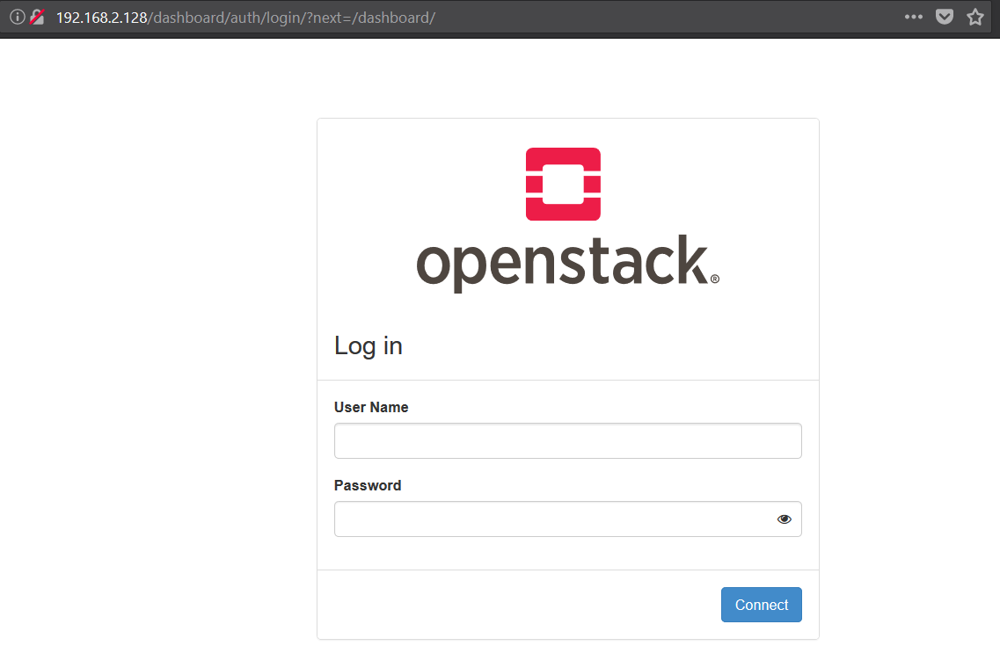
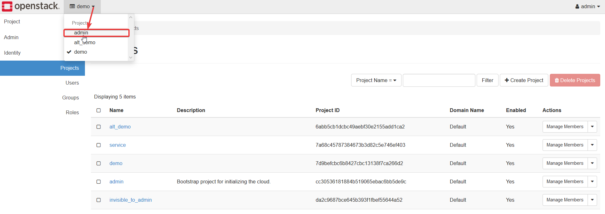
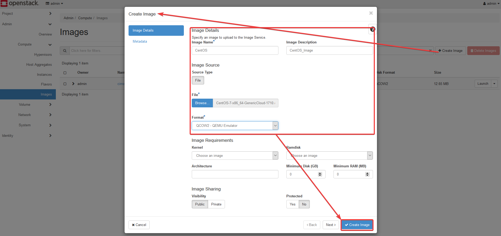
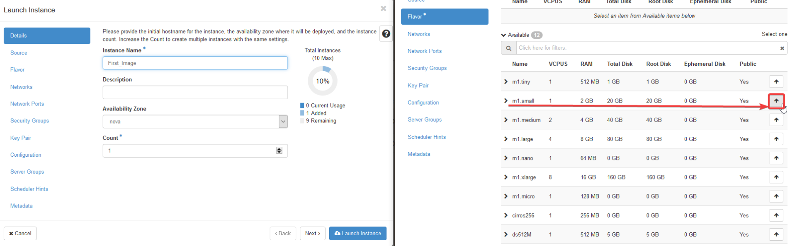
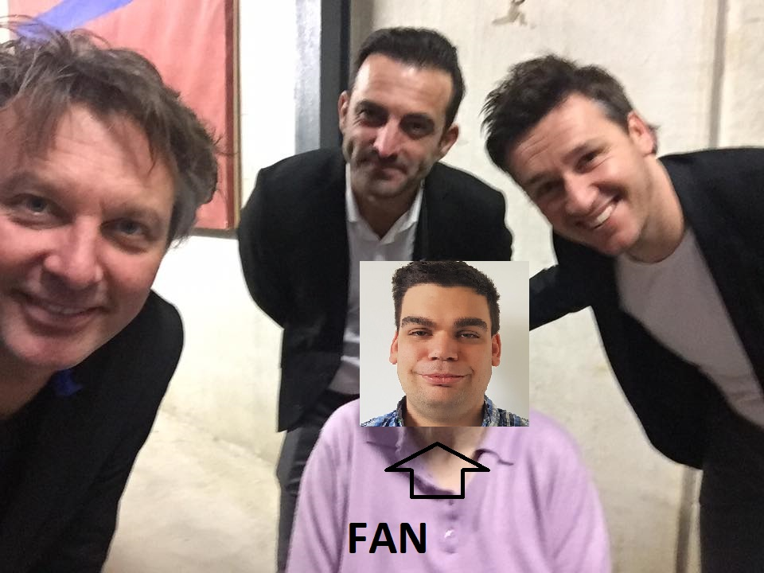

# DevStack user manual

## Using the webinterface
Once everything is installed you should be able to go to the web interface via the IP and see the login screen as shown below.



Once logged in make sure u are in the admin project, This can be selected at the top left next to the OpenStack logo as shown in the image below.



Now we are going to add our images to the images section.<br>
At the left panel select Admin -> Compute -> images.<br>
On the Images page click the Create Image button on the right side of the page. Fill in the Image Name, Image Description and Browse for the image file on your Device. After this is done press Create Image at the bottom right of the window.



After the image is done you can start your image by pressing launch at the right of the window.<br>
In this example we will fill in the minimal needed to launch an image.<br>
At the details window fill in a Instance Name, and in the Flavor section pick m1.small by clicking the arrow at the right.



Your instance should now be launching.

## Using the CLI
First we need to create an SSH key:

```
ssh-keygen -q -N ""
openstack keypair create --public-key ~/.ssh/id_rsa.pub mykey
```

After the SSH key is created we need to create some security rules to allow ICMP and SSH

```
openstack security group rule create --proto icmp 3cf27cd0-3c9d-43d9-a2bf-c20bd42f438d
openstack security group rule create --proto tcp --dst-port 22 3cf27cd0-3c9d-43d9-a2bf-c20bd42f438d
```

After all this is done we can create an instance and add the security group and SSH key to it.

```
openstack server create --flavor m1.small --image cirros-0.3.5-x86_64-disk --nic net-id=a598735c-baf8-4268-99d6-03fcd7ea41be --security-group 3cf27cd0-3c9d-43d9-a2bf-c20bd42f438d --key-name mykey provider-instance-Cirros
```



En hier is dan ons nieuw bang bang saapjen


Ik heb een nieuwe vriendin leren kennen, het was super leuk xoxox


